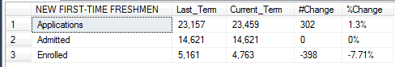
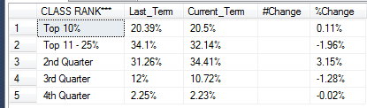
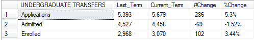
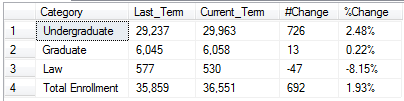

# SQL
Stored procedure that is created to display and compare Fall Uncertified Enrollment Numbers in Texas Tech University, from 2009-2016.


Fetching Applied/Admitted data for different categories : NEW FIRST-TIME FRESHMEN,AFRICAN AMERICAN,HISPANIC,CLASS RANK,UNDERGRADUATE TRANSFERS,NEW GRADUATE STUDENTS,RETENTION/GRADUATION RATE,DEGREES AWARDED,SEMESTER CREDIT HOURS,HEADCOUNT ENROLLMENT and ENROLLMENT BY HOME.

-----------
# Parameters

```
@Term int,
@reportType varchar(20)
```
We have to declare 2 parameters and pass a numeric value year to @Term and a reportType to indicate which section of stored procedure we want to execute, ie. which category of Applied/Admitted data we want.
We can pass years from 2009-2016.

-------------
# NEW FIRST-TIME FRESHMEN

Here, i am finding out the Applied/Admitted data for New First Time Freshmen.
The reportType here is 'UNCERTNEWFRESH' and thr Term is 20172 (indicates year 2016).
Also, i am getting the data for the previous term, ie. 2015.
Later i calculate the #Change and %Change.

To get Current term and Last tem i just subtract -10 from current term
```
SELECT    Case 
            when [ACADEMIC_PERIOD_ALL_SF_COMBINED] = @Term then 'Current_Term'
            when [ACADEMIC_PERIOD_ALL_SF_COMBINED] = @Term-10 then 'Last_Term'
          End      ACADEMIC_PERIOD_ALL_SF_COMBINED
            
```
To get #Change i subract values of Current term and Last term
```
replace(convert(varchar,cast((y.Current_Term - y.Last_Term) as money),1),'.00','') as '#Change'
```
And to get %Change i do (y2-y1)/y1) * 100
```
cast(round((((CAST(y.Current_Term AS FLOAT)-CAST(y.Last_Term AS FLOAT))/(CAST(y.Last_Term AS FLOAT)))* 100),2) as varchar(10)) + '%' as '%Change'
```
Output: 



-----------
# CLASS RANK

Similarly, i am finding out the Applied/Admitted data for Class Rank.
The reportType here is 'UNCERTCLASSRANK' and thr Term is 20172 (indicates year 2016).
Also, i am getting the data for the previous term, ie. 2015.
Later i calculate %Change.

Here, we have % different class ranks, ie Top 10%, Top 11-25%, 2nd Quarter, 3rd Quarter and 4th Quarter.
I am gettin the data for these different class for both current term and last term.


For last term
```
SELECT distinct    CASE
                       WHEN HSRANK IN ( 'T5', 'T10')            THEN 'Top 10%'
                       WHEN HSRANK IN ( 'T15', 'T20', 'T25')    THEN 'Top 11 - 25%'
                       WHEN HSRANK = 'Q2'                       THEN '2nd Quarter'
                       WHEN HSRANK = 'Q3'                       THEN '3rd Quarter'
                       WHEN HSRANK = 'Q4'                       THEN '4th Quarter'
                       ELSE HSRANK
                   END AS 'CLASS RANK***',
                        round( Count(*) OVER (PARTITION BY CASE
                                              WHEN HSRANK IN ( 'T5', 'T10')            THEN 'Top 10%'
                                              WHEN HSRANK IN ( 'T15', 'T20', 'T25')    THEN 'Top 11 - 25%'
                                              WHEN HSRANK = 'Q2'                       THEN '2nd Quarter'
                                              WHEN HSRANK = 'Q3'                       THEN '3rd Quarter'
                                              WHEN HSRANK = 'Q4'                       THEN '4th Quarter'
                                              ELSE HSRANK
                                          END)*100/Cast(Count(*) OVER (PARTITION BY ACADEMIC_PERIOD) AS float), 2) as 'Last_Term',hsrank
```

For current term
```
SELECT distinct    CASE
                       WHEN HSRANK IN ( 'T5', 'T10')            THEN 'Top 10%'
                       WHEN HSRANK IN ( 'T15', 'T20', 'T25')    THEN 'Top 11 - 25%'
                       WHEN HSRANK = 'Q2'                       THEN '2nd Quarter'
                       WHEN HSRANK = 'Q3'                       THEN '3rd Quarter'
                       WHEN HSRANK = 'Q4'                       THEN '4th Quarter'
                       ELSE HSRANK
                   END AS 'CLASS RANK***',
                        round( Count(*) OVER (PARTITION BY CASE
                                              WHEN HSRANK IN ( 'T5', 'T10')            THEN 'Top 10%'
                                              WHEN HSRANK IN ( 'T15', 'T20', 'T25')    THEN 'Top 11 - 25%'
                                              WHEN HSRANK = 'Q2'                       THEN '2nd Quarter'
                                              WHEN HSRANK = 'Q3'                       THEN '3rd Quarter'
                                              WHEN HSRANK = 'Q4'                       THEN '4th Quarter'
                                              ELSE HSRANK
                                          END)*100/Cast(Count(*) OVER (PARTITION BY ACADEMIC_PERIOD) AS float), 2) as 'Current_Term', hsrank

```
Later, i order them according to the ranks.

```

 order by
 case when a.[CLASS RANK***] = 'Top 10%' then 1 
      when a.[CLASS RANK***] = 'Top 11 - 25%' then 2 
	  when a.[CLASS RANK***] = '2nd Quarter' then 3 
	  when a.[CLASS RANK***] = '3rd Quarter' then 4 
	  when a.[CLASS RANK***] = '4th Quarter' then 5 END
 ```
 Output:
 
 

-----------
# UNDERGRADUATE TRANSFERS

Similarly, i am finding out the Applied/Admitted data for Undergrad Transfers.
The reportType here is 'UNCERTUNDERGRAD' and thr Term is 20172 (indicates year 2016).
Also, i am getting the data for the previous term, ie. 2015.
Later i calculate %Change.

Output: 



------
For these categories : NEW GRADUATE STUDENTS,DEGREES AWARDED,SEMESTER CREDIT HOURS,HEADCOUNT ENROLLMENT and ENROLLMENT BY HOME
The header text in stored procedure is Category, i am replacing Category with the desired header text.




For ex. for Headcount Enrollment, this is the code in asp.net
```
<asp:BoundField HeaderText="HEADCOUNT ENROLLMENT" HtmlEncode="false" DataField="Category" >
```
