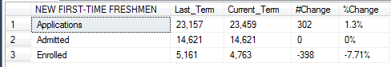

# SQL
Stored procedure that is created to display and compare Fall Uncertified Enrollment Numbers in Texas Tech University, from 2009-2016.


Fetching Applied/Admitted data for different categories : NEW FIRST-TIME FRESHMEN,AFRICAN AMERICAN,HISPANIC,CLASS RANK,UNDERGRADUATE TRANSFERS,NEW GRADUATE STUDENTS,DEGREES AWARDED,SEMESTER CREDIT HOURS,HEADCOUNT ENROLLMENT and ENROLLMENT BY HOME.

-----------
#Parameters

```
@Term int,
@reportType varchar(20)
```
We have to declare 2 parameters and pass a numeric value year to @Term and a reportType to indicate which section of stored procedure we want to execute, ie. which category of Applied/Admitted data we want.
We can pass years from 2009-2016.

-------------
#NEW FIRST-TIME FRESHMEN

Here, i am finding out the Applied/Admitted data for New First Time Freshmen.
The reportType here is 'UNCERTNEWFRESH' and thr Term is 20172 (indicates year 2016).
Also, i am getting the data for the previous term, ie. 2015.
Later i calculate the #Change and %Change.

To get Current term and Last tem i just subtract -10 from current term
```
SELECT    Case 
            when [ACADEMIC_PERIOD_ALL_SF_COMBINED] = @Term then 'Current_Term'
            when [ACADEMIC_PERIOD_ALL_SF_COMBINED] = @Term-10 then 'Last_Term'
            
```
To get #Change i subract values of Current term and Last term
```
replace(convert(varchar,cast((y.Current_Term - y.Last_Term) as money),1),'.00','') as '#Change'
```
And to get %Change i do (y2-y1)/y1) * 100
```
cast(round((((CAST(y.Current_Term AS FLOAT)-CAST(y.Last_Term AS FLOAT))/(CAST(y.Last_Term AS FLOAT)))* 100),2) as varchar(10)) + '%' as '%Change'
```
Output: 




